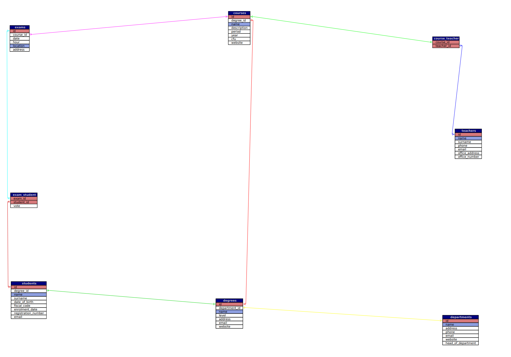

# DIAGRAM



# Contare quanti iscritti ci sono stati ogni anno
```sql
SELECT COUNT('id') AS `students_number`, YEAR(`enrolment_date`)
FROM `students`
GROUP BY `anno_di_iscrizione`;
```
# Contare gli insegnanti che hanno l'ufficio nello stesso edificio
```sql
SELECT COUNT(`id`) AS `teachers_number`, `office_address`
FROM `teachers`
GROUP BY `office_address`;
```
# Calcolare la media dei voti di ogni appello d'esame
```sql
SELECT AVG(`vote`), `exam_id`
FROM `exam_student`
GROUP BY `exam_id`;
```
# Contare quanti corsi di laurea ci sono per ogni dipartimento
```sql
SELECT COUNT(`degrees`.`id`) AS `degree_course`, `departments`.`name` AS `department`
FROM `degrees`
JOIN `departments` ON `degrees`.`department_id` = `departments`.`id`
GROUP BY `department`;
```